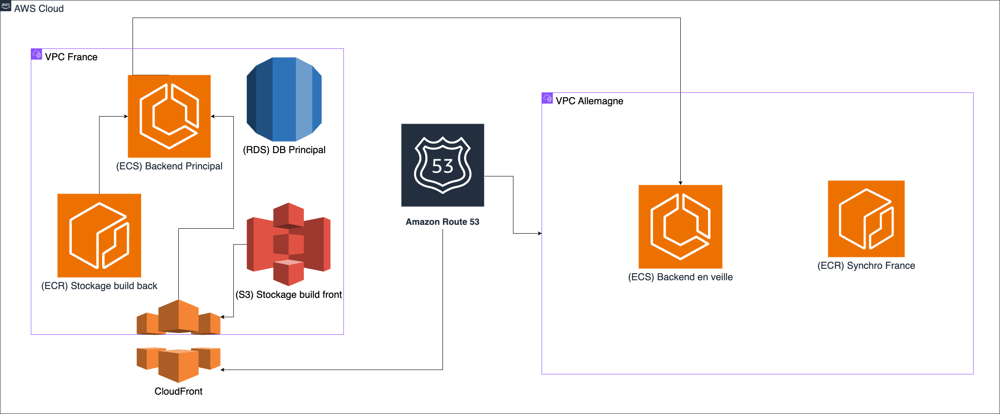

# 📌 Documentation de l'Infrastructure AWS - JeanCloud

## 📖 Table des matières
1. [Présentation](#présentation)
2. [Architecture Globale](#architecture-globale)
3. [Infrastructure Réseau](#infrastructure-réseau)
4. [Services Backend](#services-backend)
5. [Services Frontend](#services-frontend)
6. [Base de Données](#base-de-données)
7. [Sécurité et IAM](#sécurité-et-iam)
8. [Nom de Domaine et Routage](#nom-de-domaine-et-routage)
9. [CI/CD et Déploiement](#cicd-et-déploiement)

---

## 1️⃣ Présentation
JeanCloud est une infrastructure cloud basée sur **AWS** qui héberge une application web composée d’un **backend Django** et d’un **frontend statique**. L’infrastructure est **scalable, sécurisée et multi-régions**, avec une architecture active/passive.

---

## 2️⃣ Architecture Globale
JeanCloud est réparti sur **deux régions AWS** :

### **🌍 Région France (actif)**
- Héberge tous les services actifs : **ECS, ECR, RDS, ALB, CloudFront, Route 53**.
- Utilise **ECS Fargate** pour exécuter le backend Django.
- **S3 + CloudFront** pour héberger et distribuer le frontend.
- **RDS PostgreSQL** pour stocker les données applicatives.

### **🇩🇪 Région Allemagne (backup minimaliste)**
- Contient **un ECR synchronisé** avec la France pour les images Docker.
- **ECS en veille** : infrastructure prête à être activée en cas de basculement.

---

## 3️⃣ Infrastructure Réseau

### **📌 Région France**
- **VPC** (`jeancloud-vpc-france`) → CIDR `10.0.0.0/16`
- **Subnets** :
    - `10.0.1.0/24` (Public AZ1) → Load Balancer
    - `10.0.2.0/24` (Public AZ2) → Load Balancer
    - `10.0.3.0/24` (Privé AZ1) → ECS, RDS
    - `10.0.4.0/24` (Privé AZ2) → ECS, RDS
- **Internet Gateway** (`jeancloud-igw-france`) pour accès public
- **Route Table** (`jeancloud-route-public`) pour rediriger le trafic externe

### **📌 Région Allemagne**
- **VPC** (`jeancloud-vpc-germany`) → CIDR `10.1.0.0/16`
- **Subnets privés uniquement** (prévu pour un failover éventuel)

---

## 4️⃣ Services Backend

### **📌 ECS (Backend Django)**
- **Cluster ECS** (`jeancloud-cluster-france`)
- **ECS Service** (`jeancloud-backend`) :
    - Tâches `Fargate` auto-scalables
    - Image Docker stockée dans **ECR**
    - Connecté à **ALB** via un **Target Group IP**
    - Communique avec **RDS PostgreSQL**

### **📌 Load Balancer (ALB)**
- **Application Load Balancer (ALB)** (`jeancloud-alb`)
- **Listeners HTTP 80** redirigeant vers **ECS**
- **Target Group** configuré en **mode IP** pour Fargate

---

## 5️⃣ Services Frontend

### **📌 S3 + CloudFront**
- **Bucket S3** (`jeancloud-frontend`) → Stocke les fichiers statiques du frontend
- **CloudFront** (`jeancloud-cdn`) → Accélère la distribution
- **CI/CD pousse le build frontend sur S3**

---

## 6️⃣ Base de Données

### **📌 RDS PostgreSQL**
- **Instance** (`jeancloud-db-france`)
- **Multi-AZ avec sous-réseaux privés**
- **Accessible uniquement depuis ECS**
- **Sauvegarde automatique activée**

---

## 7️⃣ Sécurité et IAM

### **📌 Rôles et Permissions**
- **IAM Role ECS** → `jeancloud-ecs-execution-role` (autorise l'accès à ECR)
- **IAM Policy** → `AmazonECSTaskExecutionRolePolicy` attachée
- **Security Groups** :
    - `jeancloud-sg-alb` → Ouvre **port 80** vers le public
    - `jeancloud-sg-ecs` → Permet la connexion **ALB → ECS**
    - `jeancloud-sg-rds` → Permet la connexion **ECS → RDS**

---

## 8️⃣ Nom de Domaine et Routage

### **📌 Route 53**
- **Zone Hébergée** (`jeancloud.rocks`)
- **Redirections** :
    - `api.jeancloud.rocks` → ALB (Backend ECS)
    - `www.jeancloud.rocks` → CloudFront (Frontend S3)
- **Gestion DNS et SSL via AWS Certificate Manager (à venir)**

---

## 9️⃣ CI/CD et Déploiement

### **📌 Pipeline CI/CD**
- **GitLab CI/CD ou GitHub Actions**
- **Déploiement Backend :**
    1. **Build Docker**
    2. **Push sur ECR**
    3. **Mise à jour de la tâche ECS**
    4. **Redéploiement automatique**

- **Déploiement Frontend :**
    1. **Build Frontend (`npm run build`)**
    2. **Upload sur S3 (`aws s3 sync dist/ s3://jeancloud-frontend/ --delete`)**
    3. **Invalidation CloudFront (`aws cloudfront create-invalidation --paths "/*"`)**

---

